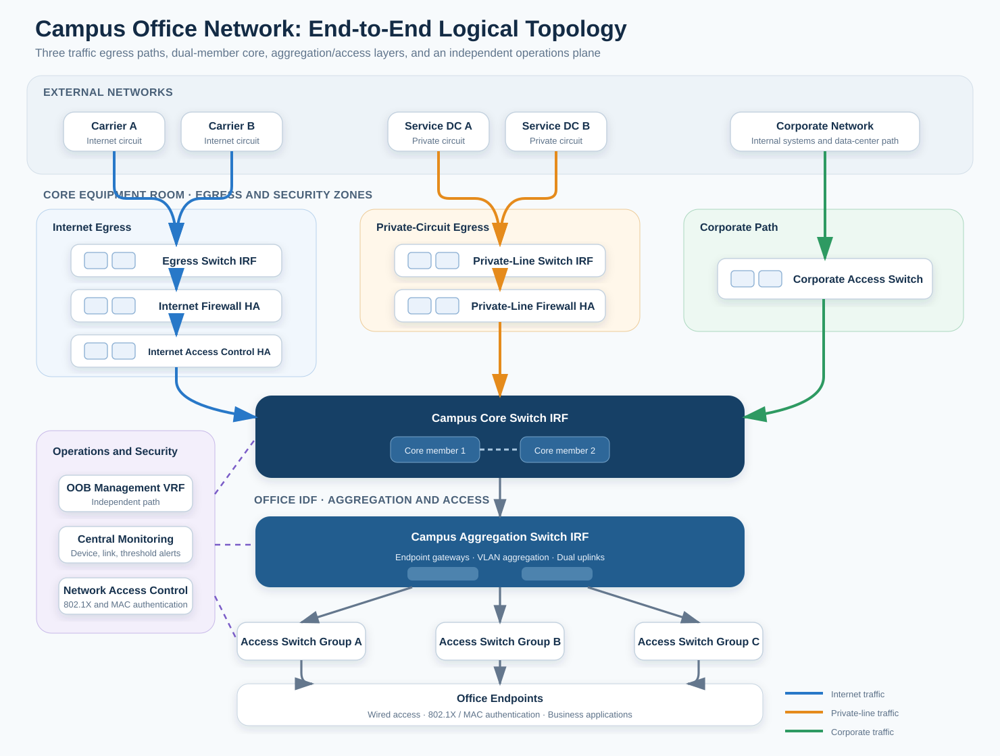
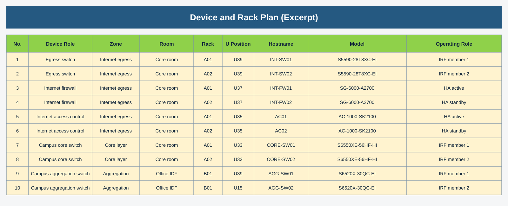
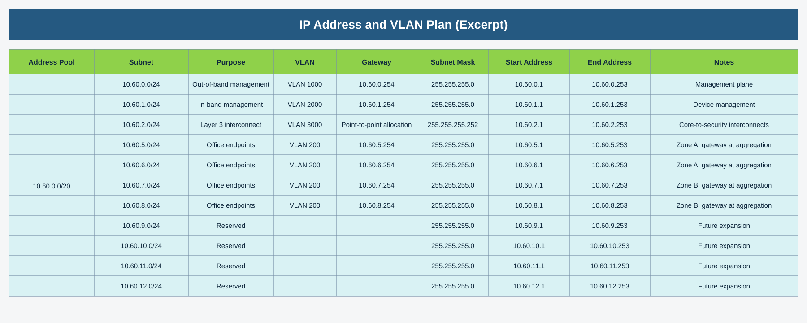
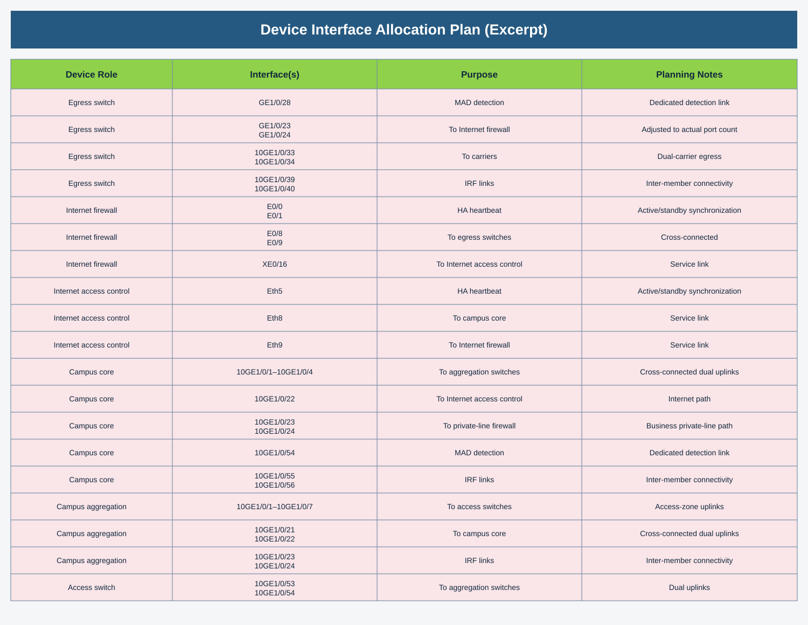
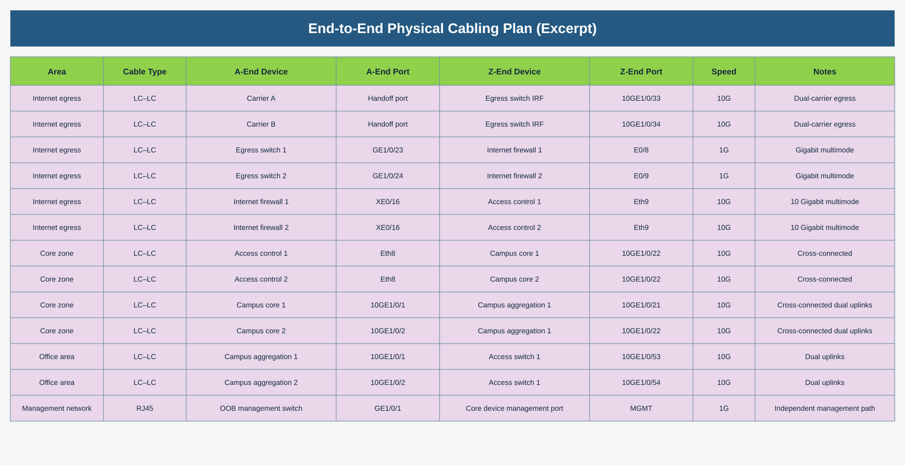
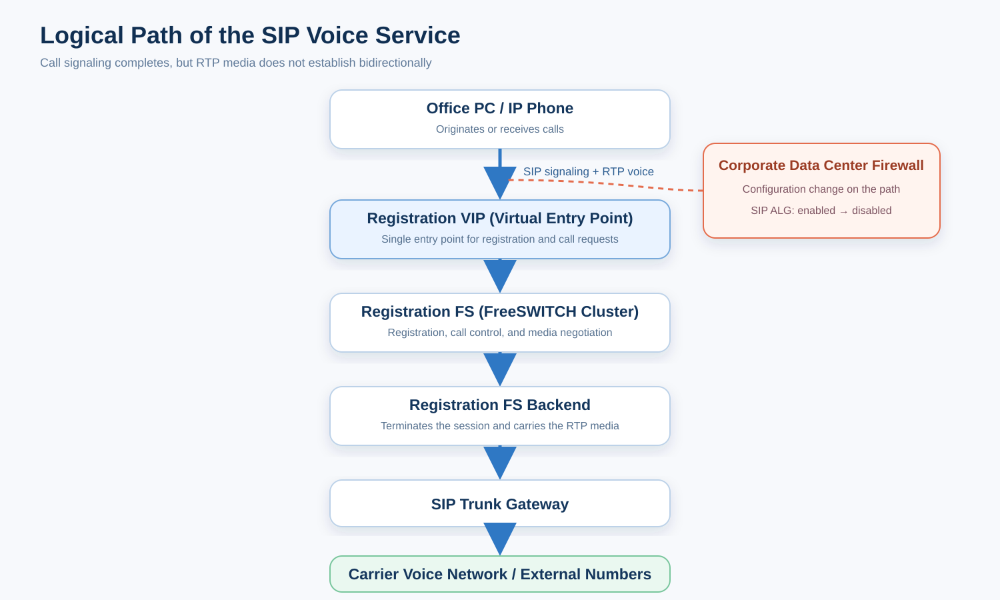
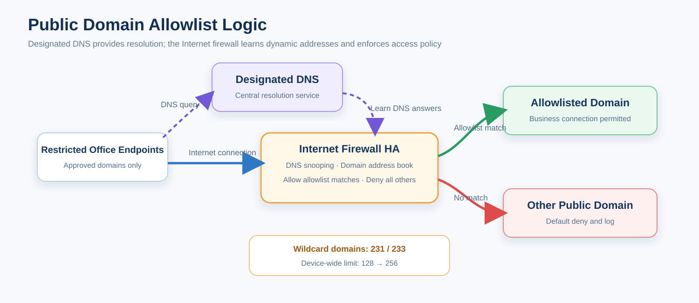

# Campus Office Network Deployment Project Retrospective

## Project Background

This was a greenfield campus office network deployment. Before the new office opened, the network team had to complete solution design, resource planning, equipment deployment, circuit provisioning, business validation, and on-site support—all before employees officially moved in. Following the requirements review, only the office network proceeded to implementation; the other service networks discussed in the early design were not included in the final delivery scope.

At first glance, an office network appears to be about providing Internet access to endpoints. Once the requirements were mapped out, however, the traffic fell into at least three categories:

1. General office traffic to the Internet;
2. Traffic to core business systems over private circuits;
3. Traffic to internal corporate systems and other data centers over the corporate network.

Each traffic class used a different egress path, passed through different security controls, and followed a different failover path. Once employees moved into the new office, Internet access, email, customer service, engineering collaboration, operations platforms, and internal management systems all had to be available at the same time. The final business test list covered more than 40 system endpoints. If even one required path was not working, the project could not be considered delivered—regardless of whether every network device showed an Up status.

I served as the core network engineer on the project, with responsibilities spanning initial planning, production rollout, business migration, and post-launch monitoring. The main challenge was not any individual configuration command. It was bringing room readiness, network architecture, structured cabling, carrier circuits, security requirements, and business migration into a single, coordinated delivery plan.

## Network Architecture

### Architecture Overview

Office endpoints connect to Layer 2 access switches, which uplink to the campus aggregation switches. Endpoint gateways reside at the aggregation layer; access switches retain only management addresses and Layer 2 VLANs. The aggregation layer connects to the core over Layer 3 transit links. This design separates endpoint access, gateway services, and egress routing. Additional access switches or office-area changes can therefore be introduced without repeatedly modifying the core egress design.

The core switch pair is the routing hub for the office network and connects upstream to three types of paths:

- **Internet path:** Traffic passes from the core through the Internet access control appliances, Internet firewalls, and egress switches before reaching the carrier circuits. The firewalls enforce security policy and NAT, the Internet access control appliances provide auditing, and the carrier circuits operate in a primary/backup arrangement.
- **Private-circuit path:** Traffic passes through dedicated private-line firewalls and switches to reach multiple service data centers. The private-circuit network is separate from the Internet edge, so security policy, routing, and fault isolation are managed independently.
- **Corporate path:** The core connects through a corporate access switch to the internal network. This path provides access to corporate systems and other data centers and also serves as an alternate route for selected bandwidth-sensitive applications.

The core, aggregation, Internet egress, and private-line switches are deployed as dual-member IRF systems. The Internet firewalls, private-line firewalls, and Internet access control appliances operate as HA pairs. Adjacent layers are cross-connected to prevent a single device or uplink from becoming a network-wide point of failure. Access switches are deployed by office area and use dual uplinks to the aggregation IRF.

### Roles of the Core and Aggregation Layers

The core does not host every endpoint gateway. Its primary role is to aggregate routes from the office areas and forward traffic to the Internet, private-circuit, or corporate path according to the destination prefix. Centralizing the three egress paths at the core also makes routing policy and failure-path control easier to manage consistently.

The aggregation switches host endpoint gateways and aggregate the endpoint VLANs. When an endpoint comes online through the access layer, its first Layer 3 hop is at the aggregation layer; traffic destined for another service zone is then passed to the core. This boundary limits Layer 2 broadcast domains while keeping desk expansion and access-switch replacement confined to the access side, without disturbing the egress security architecture.

The Internet and private-line firewalls are deployed as separate pairs because the two traffic types have different control objectives. The Internet side focuses on NAT, external access control, and carrier failover. The private-circuit side focuses on access between internal address spaces, business-subnet policy, and data-center routing. Keeping the two domains separate gives policy changes a clearer blast radius and makes it easier to determine whether an incident belongs to the Internet edge or an internal business path.

### Operations and Security Plane

An independent management path was designed alongside the production network. Devices in the core equipment room connect to an out-of-band management network, with management traffic isolated in a dedicated VRF. Management services such as SSH, SNMP, and NTP are restricted to approved source addresses. Unused interfaces are shut down, while endpoint-facing ports use STP Edge and BPDU Protection to prevent an incorrectly connected unmanaged switch or looping device from affecting an entire office area.

Endpoint admission uses 802.1X and MAC authentication in parallel. Office endpoints that support 802.1X use user- or device-based authentication; special-purpose endpoints that cannot run 802.1X follow a controlled MAC-authentication workflow. Network access control was not bolted on at the end of the project—it was incorporated into the access-switch templates and validated as part of business testing.

## My Responsibilities

I translated business requirements into an implementable network design and drove that design through the full delivery lifecycle. My main responsibilities included:

- Designing the end-to-end topology around office use cases, equipment-room resources, and the migration schedule;
- Producing the bill of materials, rack elevations, IP and VLAN plan, interface map, and physical cabling schedule;
- Defining configuration baselines for the core, aggregation, access, security, and out-of-band management domains;
- Coordinating with the corporate network team, carriers, equipment vendors, systems integrators, and on-site structured-cabling contractors;
- Participating in device power-on, IRF formation, link turn-up, high-availability testing, and private-circuit activation;
- Organizing business-access testing, tracking failed items, and confirming the actual traffic path;
- Providing on-site support during the office move and onboarding devices and circuits into centralized monitoring;
- Troubleshooting post-launch SIP media issues and implementing controlled Internet-access requirements.

On projects like this, it is easy for a network engineer to focus only on configuration. I focused on making every technical deliverable directly usable by the next stage: the topology had to drive interface planning; the interface plan had to map to cable labels; the routing design had to become a set of test cases; and the test results had to feed back into monitoring and acceptance documentation.

## Phase 1: Solution Planning

### Starting with Business Traffic Paths

At project kickoff, I first established who needed to reach which systems, and only then decided how the network should be connected. Although the Internet, private-circuit, and corporate paths all terminated at the core, they could not be reduced to three lines on a diagram. Each path had to answer the following questions:

- Which devices and security zones does it traverse?
- Where are the gateway and routing boundaries?
- How does traffic fail over when the primary circuit fails?
- Which systems must use a specific path?
- Should traffic automatically fail back when the circuit recovers?
- Who owns the local configuration, the remote-end configuration, and business validation?

Only after those paths were understood did the topology become implementable. The Internet edge used multiple carriers, with the primary circuit carrying traffic under normal conditions and a backup circuit taking over on failure. The private-circuit side connected to several service data centers through dedicated firewalls. The corporate path connected directly to the internal network, carrying corporate-system traffic while preserving an alternate inter-data-center route.

The design also distinguished **device redundancy** from **business-path redundancy**. An IRF switch pair does not guarantee that a carrier circuit has a backup. Likewise, an active/standby firewall pair does not guarantee that a route will be withdrawn when an upstream private circuit fails. For every business path, we separately confirmed the devices, physical links, next hops, return route, and failure trigger.

### Breaking the Design Down to Racks and Ports

The design phase had to produce more than a logical topology. I divided the plan into ten related worksheets covering the network topology, device models, front-panel layouts, equipment list, rack elevations, interface allocation, cabling relationships, IP addressing, transit addressing, and configuration requirements.

The physical resource plan tracked:

- Device role, equipment room, rack, U position, and hostname;
- Ports used for IRF, HA, MAD, production traffic, and management;
- A-end device, A-end port, Z-end device, and Z-end port;
- Fiber or copper type, transceiver specification, speed, and bidirectional labels;
- Responsibility boundaries among the circuit provider, device implementation team, and on-site cabling team.

The logical resource plan tracked:

- Address space for endpoint networks, in-band device management, out-of-band management, and point-to-point transit links;
- VLAN, gateway, subnet mask, allocatable range, and intended use;
- Layer 3 transit networks between the core, aggregation, and security devices;
- Contiguous address space reserved for future office-area expansion;
- Configuration baselines for hostnames, interface descriptions, NTP, SNMP, and source-restricted SSH access.

The equipment list recorded not only the model, but also each device's role, zone, equipment room, rack, U position, logical name, and dual-device operating mode. It therefore served both installation and asset-verification purposes.

The IP plan divided a common address pool into management, Layer 3 transit, office endpoint, and reserved subnets, while documenting the VLAN, gateway, subnet mask, usable range, and gateway location.

The planning workbook was not completed at kickoff and then archived. It remained the project's single source of truth throughout implementation. Every link in the topology had to appear in both the interface map and cabling schedule, and the endpoint devices and ports had to match the physical labels. The IP and VLAN plan had to map to the configuration scripts. If testing changed a traffic path, the final topology and operations documentation had to be updated as well.

When the project scope changed, I also reduced the device, port, cabling, and acceptance scope to match what was actually delivered instead of carrying forward items from an early plan. This prevented work that had merely been discussed from being represented as completed and kept unnecessary configuration out of the production network.

### Designing Failure States in Advance

High availability could not stop at purchasing two devices. During design, I reviewed the actual failure modes layer by layer:

- If either core or aggregation IRF member failed, could the surviving member continue to provide gateways, routing, and aggregated links?
- If any physical member link between access and aggregation, or between aggregation and core, failed, would the LACP bundle retain at least one forwarding member?
- If the IRF links failed, would multi-active detection prevent both systems from forwarding simultaneously?
- If the active firewall or Internet access control node failed, would sessions, NAT, and forwarding move to the standby node?
- If the primary Internet circuit failed, would the backup carrier route take over without triggering unrelated device failovers?
- If a business private circuit failed, was another private circuit or an inter-data-center detour available to that service data center?
- Could monitoring detect a soft failure in which the physical interface remained Up while the remote destination was no longer reachable?
- If out-of-band management failed, was local console access still available?

These failure states later became the integration and acceptance test cases. Before the office move, the project team already knew which link or device to take down, which states to observe, whether adjacent layers should fail over, and what constituted genuine business recovery.

## Phase 2: Build and Delivery

### Device Installation and Physical Connectivity

When the equipment arrived, we checked models, cards, transceivers, power supplies, and rack positions against the rack elevations before connecting IRF, HA, uplink, downlink, and out-of-band management links. Every patch cable received bidirectional labels identifying the A-end device and port and the Z-end device and port. Connection status was then recorded against each planned link.

The interface map listed the ports used for IRF, HA, MAD, uplinks, downlinks, and business links by device role. If port capability or availability changed, the interface map was updated first, followed by the configuration and cabling plan.

The cabling schedule placed the area, media type, A- and Z-end devices, A- and Z-end ports, speed, and media requirements for each link on one line, allowing the installation team to cable the network and create bidirectional labels directly from the document.

During interface review, I found that the actual number of usable ports on one egress-switch model did not match the numbering in the first draft. Had this been discovered only after racking, it would have forced an unplanned recable, relabeling, and configuration change. I reassigned the firewall-facing ports during planning and synchronized the change with both the equipment vendor and the cabling team, so the site team worked from the updated version.

The equipment vendor, systems integrator, and structured-cabling team were all on site during implementation. The vendor handled device-side implementation, the cabling team handled the equipment-room and office-area cabling, the carriers delivered the circuits, and the corporate network team supported remote-end changes. My role was to manage the interfaces between those groups: an interface-plan change had to reach the cabling team, a configuration change had to reach the vendor, and carrier-circuit status had to feed into routing tests. Each team completing only its own isolated task would not have delivered a working network.

A link light was not sufficient to move to the next stage. We also verified speed, duplex, optical power, interface errors, LACP membership, IRF state, and HA state. Physical-layer issues are least expensive to resolve at this point in the deployment.

### Configuration Baselines and Security Controls

The switching design followed a clear boundary: Layer 2 at access, endpoint gateways at aggregation, and route aggregation at the core. Access-switch configuration included endpoint VLANs, dual uplinks, interface descriptions, edge-port behavior, and loop protection. The aggregation layer hosted gateways and endpoint subnets. The core maintained static routes and next hops for the three egress paths.

The production configuration matched the planned HA design. Each core and aggregation system used two physical members in one IRF, with multiple physical IRF links between the members. Each access switch's two uplinks terminated on different members of the aggregation IRF and joined the same dynamic LACP bundle. The aggregation-to-core bundle likewise spanned both IRF members at both ends. The core and selected critical IRF systems also used BFD-based MAD to suppress dual-active forwarding after an IRF split.

At the Internet edge, we configured primary and backup default routes, NAT, and security policy. The private-circuit side allowed the required business subnets, while bidirectional routing was verified with each service data center. Internal prefixes were maintained separately for the corporate path. The core used remote NQA probes at one-second intervals for multiple private circuits, and selected business prefixes used primary and backup static routes with different preferences. After configuration, I initiated real connections from an endpoint and checked the route, session table, and interface counters hop by hop at the core and firewalls. Device-to-device ping alone was not accepted as proof that the application worked.

The management plane followed a common hardening baseline: SSH, SNMP, and NTP were restricted by source; unused ports were shut down; LLDP was enabled; and endpoint-facing ports used STP Edge and BPDU Protection. RADIUS, 802.1X, and MAC authentication were configured on the access side, and testing covered successful authentication, failed authentication, and approved special-purpose endpoints.

### A Traffic-Path Adjustment

During integration testing, a bidirectional video service exposed a pronounced burst-traffic pattern. Basic connectivity tests were successful, but the application began to stutter when several video streams were established at the same time.

The diagnosis was based on monitoring data rather than an on-site impression. The private-line switches had already been integrated with Prometheus. The platform calculated inbound and outbound rates over a one-minute window from `ifHCInOctets` and `ifHCOutOctets`, and Grafana displayed the utilization trends. The alert threshold for the 10 Mbit/s private circuit was set to 8 Mbit/s, or 80 percent. During multi-stream testing, the Grafana graph remained pinned at the circuit's bandwidth ceiling, and the alert timestamps aligned with the application stutter. This confirmed that the bottleneck was circuit capacity—not switch forwarding, packet loss inside the LAN, or application-server performance.

I compared the available paths again. The original private-circuit path had low latency but only 10 Mbit/s of capacity. The corporate network took a longer route through other data centers, adding approximately 20–30 ms of latency, but had more than 1 Gbit/s of available capacity across the path. We therefore moved only the bidirectional video traffic to the corporate path; ordinary business traffic continued to use the original private circuit.

After the change, we repeated the multi-session test while observing both paths in Prometheus and Grafana. The original private circuit was no longer saturated by video traffic, the corporate path showed the expected increase, and the video sessions remained stable without recurring stutter. The objective was not to put every application on the shortest path, but to make a deliberate tradeoff based on each application's actual sensitivity to bandwidth and latency.

## Phase 3: Testing and Migration Assurance

### High-Availability and Circuit Testing

Once the devices, circuits, and routes were ready, we worked through the failure checklist defined during planning. The test was not limited to confirming that a standby device became Active. We also had to determine where each failure should converge and whether adjacent layers underwent an unnecessary cascading failover.

The production HA design can be summarized in three categories:

1. **Convergence within the switching layer.** The core and aggregation systems use IRF, and the access-to-aggregation and aggregation-to-core links use cross-member LACP. A single physical member or LACP member-link failure should converge locally through IRF and LACP.
2. **Active/standby failover of security devices.** The Internet and private-line firewalls use dedicated HA heartbeat links, assign a higher priority to the active node, and monitor critical upstream and downstream links or peer reachability.
3. **Egress route failover.** Carrier and private-circuit failures are handled through path probes, interface state, and static-route preference. Circuit failover and firewall HA failover are separate mechanisms and must not be conflated.

| Injected Failure | Expected Local Action | Should an Adjacent Layer Fail Over? | Verification Points |
|---|---|---|---|
| One access-switch uplink fails | LACP removes the failed member; the other cross-member uplink continues forwarding | The aggregation IRF does not change its master; neither the core nor the firewalls fail over | LAG remains Up, endpoint gateway remains reachable, business sessions continue |
| An access switch fails completely | Endpoints on that switch lose connectivity; this is the availability boundary of the current single-switch access design | Aggregation and core roles must remain unchanged, and the impact must stay within that access area | Monitoring alert, affected-port scope, spare-device replacement, and configuration-restoration procedure |
| One aggregation IRF member fails | The surviving member continues to host gateways, access bundles, and uplink bundles | Access switches lose only LAG members; the core IRF does not change master; firewalls should not fail over | IRF member state, gateway addresses, ARP/MAC tables, uplink/downlink members, and endpoint applications |
| One physical aggregation-to-core link fails | The failed member leaves the four-link cross-member bundle; the logical LAG remains Up | Neither aggregation nor core needs to change its master; egress devices do not fail over | Change in LACP Selected count, stable routing, and traffic migration to the surviving members |
| One core IRF member fails | The surviving member retains the Layer 3 interfaces and routing table for all three egress paths | The aggregation IRF does not change master; firewall HA does not fail over as long as monitored core reachability remains healthy | Default and private routes, pre- and post-NAT reachability, and traffic on each egress path |
| One physical IRF link fails | The remaining IRF links keep the fabric intact | Upstream and downstream devices do not fail over | Stable IRF topology and member state; no widespread port shutdown |
| The IRF splits completely | MAD detects the dual-active condition and shuts service-facing ports on the conflicting side, preventing simultaneous forwarding | Adjacent layers may see one set of links withdraw, but there must be no dual-active forwarding or loop | MAD state, surviving side, disabled ports, management reachability, and recovery steps |
| Active Internet firewall fails | The standby firewall takes over the HA virtual addresses, policy, and forwarding role | Neither the core IRF nor the Internet egress IRF changes master; they only relearn the virtual MAC direction | HA state, ARP/MAC relearning, NAT, new sessions, long-lived sessions, and real Internet access |
| One firewall LAG member fails | The aggregate continues forwarding while another member remains; HA is not triggered | Upstream and downstream switches do not change master, and the firewall does not fail over | LAG state, member count, packet loss, and session continuity |
| A complete firewall uplink or downlink monitored by HA fails | The current node is declared unavailable and an active/standby failover occurs | Upstream and downstream IRFs keep their roles; traffic moves to the standby firewall's LAG | HA event, virtual MAC movement, policy hits, and bidirectional return traffic |
| Active Internet access control node fails | The standby node takes over auditing and forwarding | Neither the core nor the Internet firewall should fail over as a consequence | HA role, bypass or inline link state, long-lived sessions, and Internet access |
| Primary Internet circuit fails | The primary default route is withdrawn after probe failure, and the backup default route takes over | Firewall HA roles remain unchanged; the core and egress switches do not fail over | Routing table, actual egress path, source NAT, DNS, and application access |
| One business private circuit fails | The affected interface or next hop becomes unavailable, and a backup static route or inter-data-center path takes over | The private-line firewall does not change HA role because of a single carrier-circuit failure | Destination route, NQA state, real application access, and return path |
| Failure is cleared | LACP, HA, or routing returns to the defined state; failback is observed where applicable | There must be no repeated flapping or simultaneous preemption across multiple layers | Recovery time, route stability, sessions, monitoring trends, and alert clearance |

The key lesson from this matrix is that **an adjacent device not failing over is often the correct result**. For example, after one physical member of the core IRF fails, the firewall's core-reachability probe should remain healthy as long as the logical core is still reachable. A firewall failover at that point would introduce unnecessary virtual-MAC movement, session synchronization, and route churn. Conversely, if the active firewall loses its entire upstream or downstream path, HA monitoring should move service to the standby node, while the core and egress switches simply relearn the forwarding direction without changing their own IRF master members.

Failure injection was risk-tiered. A single physical link, one LACP member, one IRF member, or a firewall active/standby transition could be tested during a maintenance window. Disconnecting every IRF link is high risk and was reserved for an isolated environment or a window with a complete rollback plan. Where the production environment could not support that test safely, we verified the MAD configuration and state and exercised lower-risk scenarios instead. Test completeness did not justify deliberately creating an uncontrolled dual-active condition.

Circuit testing also distinguished between an interface going Down and a remote destination becoming unreachable. Disconnecting the local circuit directly invalidates the associated next hop. A black hole inside the carrier network, however, may leave the local interface Up, so NQA, ICMP Track, or an application-level probe must detect the failure. The production core used one-second NQA probes against multiple private-circuit peers, while the Internet firewalls used independent link probes for the primary and backup carriers. During testing, we reviewed both probe state and the routing table to confirm that a failed probe actually affected path selection. A probe alarm alone was not treated as proof that traffic had moved.

For every scenario, an endpoint continuously generated ICMP probes, a long-lived TCP session, and real application traffic. We recorded:

1. The time of the failure injection;
2. Changes in physical-interface, LACP, IRF, MAD, HA, and routing state;
3. Packet loss during continuous probing and application recovery time;
4. Continuity of firewall sessions, NAT, and policy hits;
5. Whether Prometheus and Grafana showed traffic moving to the expected link;
6. Whether failback was stable after recovery, without route or role oscillation.

Test records followed a consistent structure: action, expected result, local-layer change, adjacent-layer change, business outcome, and conclusion. Any failed item was corrected and retested until device state, traffic path, and application behavior were all consistent.

### Validation of More Than 40 Business Services

Before the office migration, the business teams and I jointly maintained an application-access test list. It was not a static spreadsheet created once; it evolved throughout the test cycle. The first round contained 35 access items: 20 passed, 14 were unreachable, and one redirected incorrectly. The second round expanded the list to 42 items, of which 33 passed and nine still required remediation. All 42 items passed in the third round. Later versions added public IP, private IP, system ownership, hosting data center, and notes so that each system's expected traffic path was explicit.

The final list covered 42 validated items across multiple locations and egress paths, including active-active service data centers, two internal data centers, other corporate sites, and Internet services. The scope went well beyond a list of websites. It included customer-service systems, voice platforms, quality assurance, engineering collaboration, email, SMS, databases, single sign-on, video, bastion hosts, and administrative platforms, with nonstandard ports such as `8080`, `18084`, `18085`, `32081`, and `8020`.

Each item was tested in the following sequence:

1. **Resolution and destination verification.** Check the DNS response, destination private address, and public address, and confirm that the endpoint received an address appropriate for the campus access path.
2. **Network-path verification.** Determine whether the system should use the Internet, a private circuit, or the corporate path based on its owner and hosting location, then check the core route and next hop.
3. **Port and policy verification.** Confirm that the TCP connection can be established, then review the firewall address objects, service objects, policy order, and hit logs.
4. **Return-path verification.** Confirm that the remote side has a route back to the campus subnet so the request does not arrive successfully only for the reply to leave through the wrong egress.
5. **Application-function verification.** From an endpoint on the new office network, open the page or client and perform login, redirection, and basic functions rather than relying on ping alone.
6. **Business-owner validation.** After the network path is verified, have the actual users confirm that the content, permissions, and business actions behave correctly.

The test history showed how the failures converged over successive rounds. The early failures did not have one common cause: some destinations lacked a return route; some firewall policies did not allow a required nonstandard port; some domains resolved to public addresses that were inappropriate for the campus path; some systems required an internal address or a temporary hosts entry; and some systems had simply been omitted from the initial list. We corrected the relevant routes, policies, service ports, and resolution data, then preserved the retest result in the next workbook revision instead of hiding those differences behind a blanket statement that “the network is operational.”

In later revisions, the test sheet evolved from “system address + result” to “public address + private address + owner + data center + result + notes.” This turned the test list into a working traffic-path inventory. When a system later failed, operations could first identify its expected egress, firewall pair, and private circuit before deciding where to begin troubleshooting.

### Troubleshooting a SIP Voice Media Failure

Office endpoints experienced one-way audio and no audio when accessing the internal SIP telephony platform. Calls could be established, and the SIP exchange showed `INVITE`, `100`, `180`, `200 OK`, and `ACK`. It was therefore easy to make the initial mistake of assuming the network was healthy.

SIP handles registration, call setup, and media negotiation; RTP carries the actual voice stream. Successful signaling proves only that call control completed—it does not prove that bidirectional audio was established. Office endpoints entered the corporate network through the campus office network and then crossed a firewall in the corporate data center before reaching the voice platform in the destination data center.

The call originated from an office PC or IP phone, entered the registration FS cluster through the registration VIP, reached the backend that carried the actual session, and then traversed the trunk gateway to the carrier voice network.

I compared packet captures for the same type of call at three points around the endpoint, registration tier, and trunk side:

1. **Between the office endpoint and the registration VIP:** RTP from the registration platform to the endpoint was visible, but no return media from the endpoint to the platform was observed.
2. **Between the registration FS cluster and its backend:** Again, RTP was visible in only one direction.
3. **Between the backend and the trunk gateway:** RTP was present in both directions, confirming that the media path on the trunk side was healthy.

The captures reduced the failure domain from the entire voice platform to the media path between the office endpoint and the registration tier. We then reviewed the firewall audit log, ruled out several changes unrelated to the business addresses and service range, and identified the relevant global change: SIP ALG had been changed from enabled to disabled on the corporate data center firewall.

The environment did not have a complete, explicit bidirectional policy for the RTP range `UDP 10000–20000`. The service had previously depended on SIP ALG to assist with dynamic media ports. Once ALG was disabled, signaling still completed, but RTP could no longer establish bidirectionally. That behavior matched the one-way/no-audio symptoms and the results of all three capture points.

We resolved the issue by adding an explicit bidirectional RTP security policy. Validation went beyond confirming that the call connected: both parties had to hear continuous audio, bidirectional RTP had to appear at the endpoint and registration capture points, firewall sessions and policy counters had to match the real traffic, and multiple inbound and outbound calls had to complete successfully.

### Restricting Internet Access from the Office Network

After go-live, the security team required a group of office endpoints to access only approved public domains, with all non-allowlisted traffic denied. The original list contained 233 domain entries, 231 of which were wildcard domains. Some applications also used ports other than `80/443`, so conventional URL filtering alone was not sufficient.

I split the control design into two layers:

- **Domain address books as the primary control.** The firewall uses DNS snooping to learn DNS responses and dynamically map domain names to destination IP addresses. Security policy can then match the address book, including traffic on non-Web ports.
- **A URL allowlist as a supplemental control.** This provides URL, Host, or SNI control and logging for HTTP/HTTPS traffic, but does not carry responsibility for every protocol.

The policy order was: allow the designated DNS service, allow the domain address book, apply the supplemental URL allowlist, and finally deny all other Internet access. The allowlist rules were placed above the default-deny rule, with the necessary hit and session logging enabled.

During implementation, the Web interface returned an error when the 129th wildcard domain was added. Splitting the domains across multiple address books did not allow any further entries, showing that the constraint was not the number of objects in one address book but the device-wide limit on wildcard domains maintained by DNS snooping. URL filtering was not a complete substitute because it primarily applies to Web requests and cannot provide equivalent control for nonstandard ports and non-HTTP/HTTPS protocols.

After confirming the platform capability with the vendor, we increased the global limit from 128 to 256. This accommodated the 231 wildcard domains with limited growth headroom, without expanding the device's dynamic-record workload without bound. We also checked configuration synchronization and save status across the HA pair.

Validation covered allowlisted domains, ordinary subdomains, wildcard subdomains, nonstandard ports, default denial of unauthorized domains, DNS-snooping records, policy logs, TTL changes, HA failover, and the risk of browser-based DNS-over-HTTPS bypass. The approved domains were reachable, non-allowlisted traffic was consistently denied, and subsequent additions had a defined change and rollback procedure.

### On-Site Support During the Office Move

Before the move, I froze the core configuration, saved device snapshots, confirmed contact windows for the carriers, corporate network team, equipment vendors, and business validators, and opened the monitoring views for all critical devices and circuits.

As employees began working from the new office, issues were isolated progressively through the access layer, network access control, gateway, egress route, and business system. If an endpoint could not obtain an address, we first checked the desk cabling, access port, and VLAN. If it had an address but could not connect, we moved on to 802.1X or MAC authentication, the gateway, and routing. If only one application failed, we checked its expected egress, firewall session, and remote-end policy. This kept every symptom from being reduced to “the network is down” and allowed each team to take ownership of the correct layer quickly.

The focus on move day was the effect of many endpoints coming online at once: whether authentication remained stable, whether access and aggregation interfaces accumulated errors, whether Internet or private-circuit utilization spiked, and whether resource usage on the core changed abnormally. The network moved from build status to production operations only after the critical business tests passed and the monitoring trends remained stable.

### Monitoring and Delivery Closure

After go-live, the core, aggregation, access, and egress switches, along with the firewalls and Internet access control appliances, were integrated into Prometheus. Grafana dashboards displayed device availability, CPU, memory, interface state, interface errors, and link traffic.

Inbound and outbound utilization were monitored separately for Internet and private circuits. The alert threshold for a 100 Mbit/s Internet circuit was 80 Mbit/s; a 20 Mbit/s private circuit used 16 Mbit/s; and a 10 Mbit/s private circuit used 8 Mbit/s. For bursty applications such as video, device availability alone is not meaningful. Minute-level rates and historical trends are needed to distinguish a transient peak from sustained congestion.

At handover, we consolidated the final topology, equipment list, cabling schedule, configuration backups, business test results, and monitoring targets. Operations received more than device login details: they received documentation capable of answering where a device was installed, where each link terminated, which path an application used, and what to inspect during a failure.

## Project Retrospective

The campus office network was delivered on schedule and successfully supported the move into the new office. Looking back, the following practices had the greatest impact on delivery quality:

- **Map the business paths before drawing the topology.** The three egress domains have different security boundaries, routing behavior, and failure modes; a single default route cannot represent all requirements.
- **Carry the design through to ports and labels.** Racks, transceivers, cables, ports, and owners must map to one another so that installation does not depend on verbal instructions.
- **Define the failure boundary in HA testing.** A single-member or single-link failure should converge locally wherever possible. Unnecessary cascading failover across layers only expands the impact.
- **A link being Up does not mean the application is available.** Remote probes, route changes, return paths, session state, and real application behavior all need to be verified.
- **The network team cannot declare business acceptance on its own.** More than 40 systems went through multiple test rounds and user validation, exposing issues in policy, name resolution, and return routing that network-only checks would have missed.
- **Monitoring data should inform design decisions.** The bidirectional-video path was changed because Prometheus and Grafana provided direct evidence of private-circuit saturation, not because of a subjective impression.
- **Security designs must account for platform limits.** A public-domain allowlist has to address dynamic resolution, nonstandard ports, global resource limits, HA behavior, and bypass risks.
- **Give every participating team a clear interface.** Carriers, corporate networking, equipment vendors, cabling contractors, and business teams each own part of the outcome. The network engineer must connect those parts into one delivery process.
- **Operations begins when the build ends.** Monitoring, configuration backups, and documentation are not paperwork to add during closeout; they determine whether the production network can be maintained.

The project produced an end-to-end topology, rack and cabling plans, an IP and VLAN plan, configuration baselines, a business test list, HA test records, monitoring targets, and final configuration snapshots. The same delivery method can be reused for future office expansions instead of rebuilding the process from individual experience each time.
