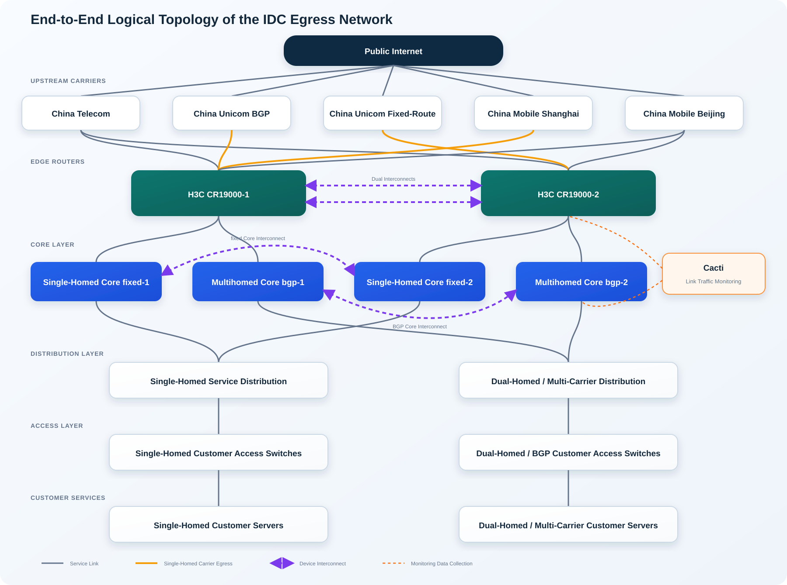
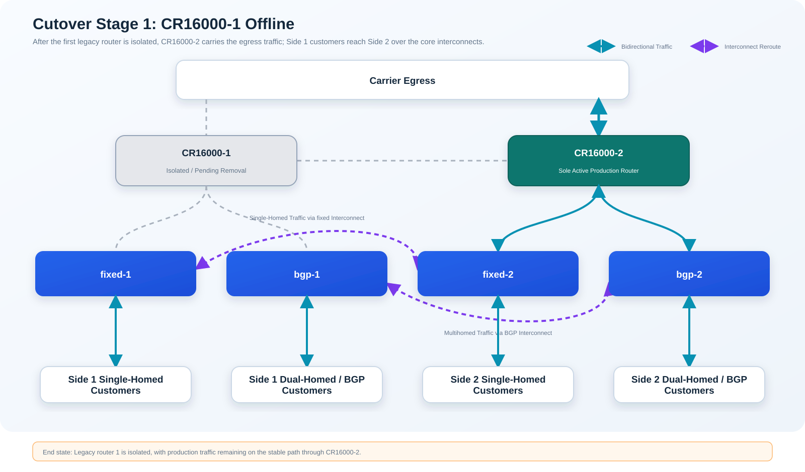
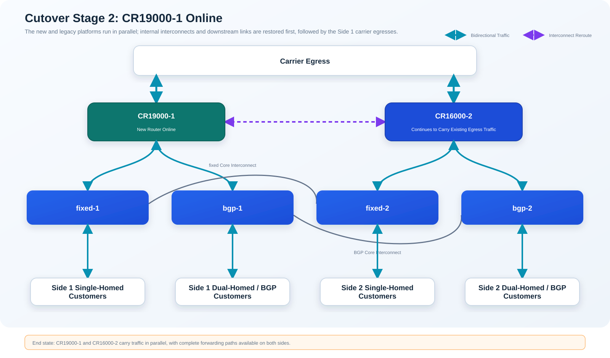
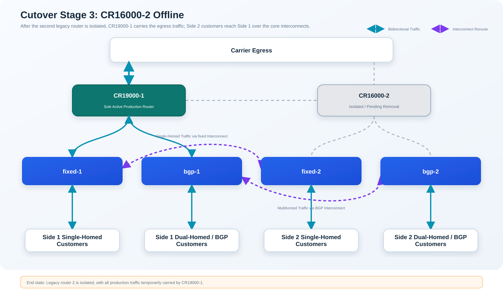
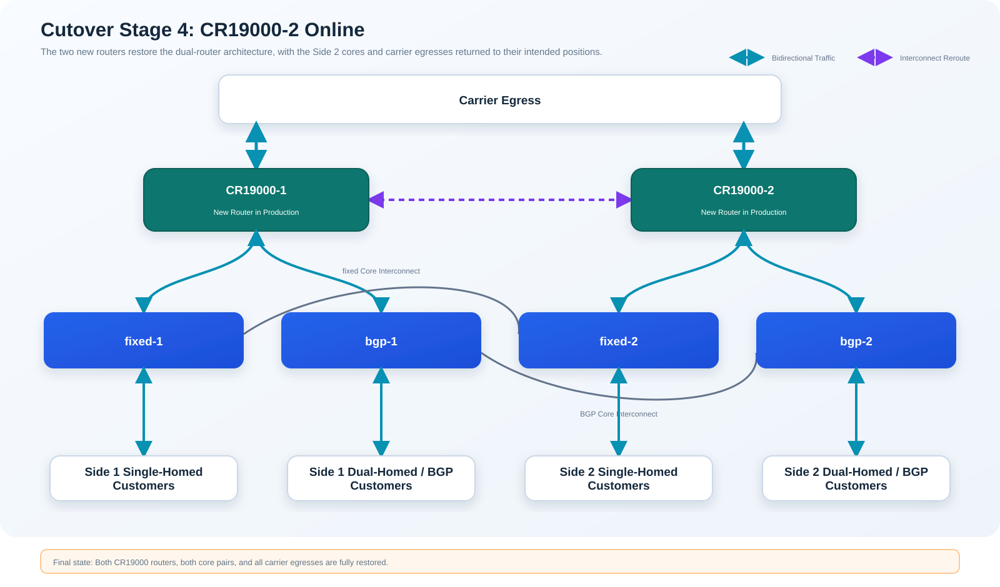

# IDC Edge Router Replacement Project: Post-Implementation Review


## Project Background

The customer is a second-tier telecom carrier. It purchases public IP address space and bandwidth from China Telecom, China Unicom, and China Mobile, then provides network services to its own IDC customers.

At one of the customer's core IDC facilities, two H3C CR16008 routers operated at the edge of the entire IDC network. Upstream, they connected to four carrier directions—China Telecom, China Unicom, China Mobile Shanghai, and China Mobile Beijing—each requiring separate coordination and validation. Downstream, they connected to the single-homed core, the multihomed BGP core, and a large number of IDC customers. Diagnostic records showed that the legacy routers had been running for more than 532 weeks. These were not just two ordinary routers; they served as the primary egress for the entire IDC.

The objective was to replace the two CR16008 routers with two H3C CR19000-8 routers. The hardware platform, line cards, and port layout would all change, as would some configuration syntax and default behaviors. The existing routing relationships, traffic policies, and customer access patterns, however, had to remain unchanged.

The redundancy model also differed from one egress service to another. China Telecom was connected to both edge routers; China Mobile Shanghai had only a single connection; China Unicom BGP and China Unicom fixed-route were two separate services connected to edge routers 1 and 2 respectively; and China Mobile Beijing required coordination with a remote site. These services could not all be migrated using the same method.

This project was therefore not a matter of simply removing the old routers and connecting the new ones. What had to be migrated was an entire set of service relationships that had evolved over many years: not only the visible ports and fiber links, but also route advertisements, inbound and outbound path selection, and the coordination mechanisms between multiple teams.


## Existing Network Architecture

### Architecture Overview



Customer servers first connected to access switches, passed through the distribution layer, and then reached either the single-homed core or the multihomed BGP core before arriving at the two edge routers. The edge routers connected upstream to the carriers and ultimately to the public Internet. If any layer along this end-to-end path failed to recover, customers could experience the result simply as “no Internet access.”

There was an interconnect between `fixed-1` and `fixed-2`, and another between `bgp-1` and `bgp-2`. When one edge router was taken offline, these interconnects could temporarily forward customers’ traffic to the egress on the other side. They provided an internal detour within the IDC, but they could not create a second upstream path for a carrier service that was physically single-homed.

The China Unicom BGP and China Unicom fixed-route egresses terminated on different edge routers and were not redundant links for the same service. When either router was taken offline, its corresponding China Unicom service still had to be moved temporarily to the other side. Once the new router was online and validated, the link could be moved back to its intended position. China Mobile Shanghai likewise had no equivalent backup egress, so its migration required the physical link, the local configuration, and the carrier-side state to be handled together. China Telecom, by contrast, could rely on its dual-sided connectivity and normal routing convergence.


### Role of the Edge Routers

The edge routers handled routing in two directions.

The first was the advertisement of customer public prefixes to the Internet. IDC customers’ servers had to be reachable by external users, so the edge routers advertised those public prefixes to the upstream carriers through BGP, telling the Internet how to reach the IDC. If a prefix was omitted, a routing policy was applied incorrectly, or the AS path changed unexpectedly during the replacement, the customer server could remain healthy inside the facility while becoming unreachable from the Internet.

The second direction was the import of Internet routes from the carriers. The edge routers received full or default routes from the upstream providers and applied routing policies to select the egress for customer traffic. Single-homed customers had to continue using their designated carrier, while multihomed customers had to retain their existing path-selection behavior across multiple egresses.

For that reason, cutover validation could not stop at confirming that the BGP sessions were Established. We also had to verify that customer prefixes were advertised through the intended carriers, that carrier routes were imported correctly, that the next hops were valid, and that actual inbound and outbound traffic followed the expected links.


## My Responsibilities

My responsibilities covered solution discussions, configuration governance, lab validation, and the production cutover. They were not limited to executing a few command sequences during the maintenance window.

At the start of the project, I worked with the customer’s network team, H3C engineers, and on-site data center staff to walk through the cutover sequence step by step. The most time-consuming questions were what would happen to customer prefix advertisements after each group of links was disconnected, where inbound and outbound traffic would move, and at which stable state the network should remain if validation did not produce the expected result. We then documented the ports, ODF fiber positions, optical modules, patch cords, power feeds, remote contacts, and business validators in a structured worksheet.

This preparation resulted in a 30-item detailed confirmation log. Every question required a conclusion and an owner; “we will check it on site” was not an acceptable answer for the production window. Once a legacy router had been powered down and removed from the rack, rollback would require reinstalling the chassis, reconnecting the cabling, and restoring the configuration, making it costly and time-consuming. Our primary safeguards were therefore pre-cutover validation, one-sided migration, and staged checkpoints.


## Phase 1: Configuration Cleanup

The legacy routers had been in service for many years, and their configurations contained a mixture of active production settings, historical remnants, and temporary changes. A direct line-by-line translation might have looked efficient, but it would also have carried old problems onto the new platform. In addition, the CR16000 and CR19000 differed in some syntax and default behaviors.


### Establishing the Production Baseline

I first saved the configurations and diagnostic information from both legacy routers and from `fixed-1`, `fixed-2`, `bgp-1`, and `bgp-2`. I then organized the upstream links, downstream links, inter-router links, monitoring ports, and out-of-band management ports into a port and cabling matrix. ACLs, static routes, BGP, PBR, link aggregation, port mirroring, AAA, IPv4, and IPv6 were reviewed as separate configuration domains.

During the review, I divided the configuration into four categories:

1. Valid configuration that could be mapped to an active port, neighbor, or service;
2. Historical configuration whose associated service object no longer existed;
3. Temporary configuration required only during an intermediate cutover state;
4. Items that could not be determined from the configuration alone and required confirmation from the customer or the relevant circuit owner.

This classification took longer than a text-based comparison between the old and new configurations, but it solved a practical problem: when someone later asked why a policy had been retained or removed, we could trace the decision back to the service object and the confirmation record instead of relying on personal memory.


### Resolving Configuration Ambiguities

The issues found during cleanup were not dramatic, but they could easily have caused confusion during the cutover. Examples included an obsolete China Unicom backup interface, duplicated ACLs, and address-family configuration with no active references. PBR belonged on the aggregate interface rather than being duplicated on member ports. Some static routes on the new platform needed to be associated with an outgoing interface, BFD, or Track so that they would be withdrawn promptly when a link failed. Router IDs, the way routing policies were invoked, the link aggregation mode, and IPv6-related behavior also had to be revalidated for the new platform.

I did not make assumptions about these items based on experience alone. Instead, each one was added to the confirmation checklist:

- Is this interface still carrying a service, and who can confirm it?
- How should this route switch between the primary and backup paths?
- Through which carriers should each customer prefix be advertised, and which advertisements may remain during the migration?
- Is this part of the final configuration, or is it required only for a specific cutover stage?
- Can the change be completed locally, or must the carrier make a coordinated change at the far end?
- What observable result will confirm that the change is correct?

The final configuration delivered for the cutover had been checked against the service requirements, adapted to the new platform, and confirmed by the customer. It was not a mechanical translation of the legacy configuration. The production cutover scripts were also organized by stage, with validation steps after each group of commands, so that the team would not execute a long sequence before discovering that an earlier step had already deviated from the expected state.


## Phase 2: Test and Validation

Before the production cutover, we built a test environment that closely reproduced the production relationships. It included two CR19000 routers, two pairs of single-homed and multihomed core devices, simulated ISP routers, and test servers. The objective went beyond confirming that the new routers could boot successfully; we needed to understand how the differences between the old and new platforms would affect actual traffic.


### Hardware Validation

Both new routers underwent separate hardware validation. The scope included software versions, line-card recognition, temperature, CPU, memory, optical modules, fan trays, power redundancy, supervisor switchover, line-card hot-swap, ECC, and switching fabric boards. Both hardware test records showed normal results.

There is little value in completing comprehensive protocol and service validation if a core egress router enters production with an unresolved hardware issue. After testing, the software versions, line-card positions, module types, and power arrangements were frozen as the deployment baseline.


### Service and Traffic Validation

Software testing covered OSPF, BGP, PBR, VRF, IPv4/IPv6, SFlow, port mirroring, AAA, and load-sharing behavior. We did not stop at checking whether interfaces were Up or BGP neighbors were Established. Traffic was generated from the customer side to validate the following:

- Whether single-homed customers continued to reach the Internet through their designated carrier;
- Whether multihomed BGP customer prefixes were advertised through the intended carriers;
- Whether inbound and outbound paths for multihomed customers matched the existing routing policy;
- Whether traffic could traverse the core interconnects and move to the other edge router when one router was disconnected;
- Whether multiple concurrent flows were distributed appropriately across the available links;
- Whether both forward and return traffic worked correctly for IPv4 and IPv6.


### Iperf Multi-Stream Testing

Iperf3 was deployed at both ends of the test environment. One endpoint represented an IDC customer server, and the other represented a carrier-side or Internet server. The server first listened on the test port:

```bash
iperf3 -s -p 5201
```

On the client, the `-P` option created multiple parallel TCP streams. The following command, for example, ran an eight-stream test for 60 seconds and reported results once per second:

```bash
iperf3 -c <server_ip> -P 8 -t 60 -i 1
```

Testing only the customer-to-Internet direction was insufficient. Adding `-R` reversed the data direction so that the server sent traffic to the client, allowing us to validate the inbound path from the Internet to the IDC:

```bash
iperf3 -c <server_ip> -P 8 -t 60 -i 1 -R
```

If every parallel stream used the same source and destination IP addresses while the device’s load-sharing algorithm considered only those addresses, the multiple TCP connections could still hash onto the same path. To exercise different hash combinations, we ran Iperf3 simultaneously from multiple test addresses or hosts and used `-B` to bind different source addresses:

```bash
iperf3 -c <server_ip> -B <source_ip> -P 8 -t 60 -i 1
```

This changed the source and destination address combinations while the parallel connections also created different transport-layer sessions. During each test, we reviewed per-stream throughput, aggregate throughput, and retransmissions, then correlated the results with router interface counters and Cacti graphs to confirm that traffic was actually using the intended links. Multi-stream testing was performed with both routers online, with one router carrying all traffic, and with the old and new platforms operating together.

This testing also demonstrated why a single ping or a single Iperf stream was not enough. Either could confirm that one path was reachable, but neither could prove that ECMP, load sharing, and multi-carrier policies continued to work under multi-session traffic.


### Feeding Test Findings Back into the Design

Testing exposed several platform differences that could not be left for the production window:

- Some static routes that specified only a next hop could continue resolving to `Null0` after the physical interface went down. The final configuration added the outgoing interface or the appropriate tracking mechanism so that the route would be removed as expected during a failure.
- A link between the two CR19000 routers once failed to recover because of transceiver compatibility. We subsequently standardized on genuine H3C transceivers and prepared spare transceivers and patch cords for links spanning different interface modules.
- The CR19000 load-sharing algorithm primarily considered source and destination IP addresses by default, which differed from the legacy platform’s behavior. The global load-sharing mode had to be adjusted and retested with multiple address combinations.
- The syntax for referencing a Prefix List from a Route Policy, the placement of PBR, and some IPv6, BFD, and Track configurations had to be adapted to the new platform.
- China Mobile Beijing required remote-side operations. Checking only the local interface was not sufficient; the far-end change, protocol convergence, and service validation had to occur within the same coordinated window.

Whenever an issue was found, I updated the final configuration, cutover procedure, and validation checklist together. This ensured that everyone on site used the same version and avoided a situation in which the test report reflected a correction but the cutover script still contained the old configuration.

We also performed a complete rehearsal of the power sequence, link migration, and service validation in the lab. Patch-cord lengths, ODF fiber positions, module locations, power feeds, and spare parts were confirmed after the rehearsal. By the time the production window began, the on-site team did not need to debate where a cable belonged and could more quickly determine whether an issue originated in the cabling or the configuration.


## Phase 3: Production Cutover

The production plan divided the cutover into four independently verifiable network states. After each stage, the team paused to check routing, traffic, and services. The next stage began only after the current state matched the expected outcome. If an issue required additional time, the network could remain in a stable single-router or mixed-platform state rather than becoming stuck with one group of links already disconnected and another not yet restored.


### Migrating Single-Homed and Dual-Homed Services

The key task for dual-homed services was convergence. China Telecom, for example, had one link to each edge router. Before replacing router 1, we confirmed that the routing and capacity on Side 2 were healthy, then shut down the Side 1 link so that traffic would converge onto router 2. Once the new router 1 was online, we restored the BGP session and route advertisements on that side. After validation, the service returned to dual-sided operation. Throughout this process, the remaining link continued to provide an egress through the same carrier.

Multihomed BGP customers could also continue advertising their prefixes through the remaining carriers, but confirming that “another link still exists” was not enough. We also had to verify that each customer prefix remained advertised through the intended egresses, that inbound traffic followed the routing change, and that the remaining links were not congested. After the new router came online, we checked that the multi-egress policies and traffic distribution had been restored.

The key task for single-homed services was physical relocation. China Mobile Shanghai, China Unicom BGP, and China Unicom fixed-route each had only one corresponding egress. Before the legacy router carrying any of these services was taken offline, we had to prepare temporary interfaces and routing policies on the other router, move the physical circuit, coordinate the carrier-side change, and validate the neighbor relationship, route advertisements, and bidirectional traffic. The legacy router’s downstream links and inter-router links could not be removed until the single-homed egress had been restored.

Single-homed customers were also governed by designated-egress policies. Even if their traffic could traverse the `fixed` core interconnect and reach the other edge router, the target carrier’s single-homed egress had to be moved with it. Otherwise, the internal detour would work while the public Internet path remained unavailable.

The rollback conditions also differed between the two service types. If a dual-homed service failed to converge correctly, the original interface could be reopened and the previous route restored. If a single-homed circuit migration failed, the physical link and configuration had to be moved back while the legacy router was still available. Once a legacy router had been powered down and removed, fast rollback was no longer possible. Each old router was therefore removed only after its single-homed egresses, downstream traffic, and monitoring graphs had all been validated.


### Cutover Preparation

The plan fixed the order: router 1 would be handled first, leaving CR16000-2 as the initial stable forwarding plane. Once CR19000-1 was online and fully validated, we would proceed with the second legacy router. Only one side of the network changed at a time, preventing both edge routers from entering an uncertain state simultaneously.

On-site responsibilities were divided among configuration, cabling, rack installation, vendor support, and service validation. Every patch cord was labeled at both ends with the device, port, ODF fiber position, and far-end information. Agreed colors were used for different link types. The A and B power feeds were verified in advance. Original modules, spare modules for inter-module links, spare patch cords, and management cables were placed where they could be reached immediately. For circuits such as China Mobile Beijing that required remote coordination, the responsible contacts and exact change points were also confirmed ahead of time.

After each group of configuration changes, the engineer announced the device, port, and expected state. The cabling engineer repeated the label before unplugging or reconnecting a cable. The validation engineer then checked routing and services against the checklist. Link lights confirmed only that the physical layer was up; they were never treated as sufficient evidence to proceed.


### Monitoring Traffic in Cacti

Before the cutover began, I opened the Cacti graphs for the China Telecom, China Unicom, China Mobile Shanghai, and China Mobile Beijing carrier interfaces, together with the downstream links and the two core interconnects on both edge routers. I recorded the normal traffic baseline first, then checked whether the graph changes matched expectations after each group of operations.

For example, after CR16000-1 was isolated, traffic on its interfaces should decline while traffic on CR16000-2 and the core interconnects should increase. After CR19000-1 came online, its interfaces should begin carrying traffic and the temporary detour traffic should decrease. If traffic declined on both the legacy router and the router expected to carry the load, all traffic became unexpectedly concentrated on a single link, total traffic showed an unexplained gap, or interface errors and drops continued to rise, the current stage would stop.

Cacti was useful for continuously observing link trends and comparing traffic before and after each stage, but its polling granularity could not replace real-time checks on the devices. After every critical transition, we also reviewed interface rates, errors, drops, BGP neighbors, routes, and next hops. Cacti confirmed whether traffic had moved; the CLI helped explain why the protocols and interfaces had changed.


### Stage 1: CR16000-1 Offline

The first step was to isolate the first legacy router, not to power it down immediately. We processed the carrier egresses, single-homed core downlink, multihomed core downlink, and inter-router links one group at a time so that every change could be observed.

China Telecom was connected to both edge routers, so the CR16000-1 link could be shut down and traffic allowed to converge onto CR16000-2. China Unicom BGP and China Mobile Shanghai terminated on router 1 and neither had a directly equivalent backup link. Temporary configuration therefore had to be prepared on CR16000-2 before the physical circuits were moved and the far-end changes coordinated. Only after the carrier neighbors, customer prefix advertisements, forward and return traffic, and Cacti graphs were all normal did we continue with the downstream links. For China Mobile Beijing, the Side 1 link was shut down at the agreed time and the far-end state was checked in parallel.

After the upstream changes were complete, the downlinks from CR16000-1 to `fixed-1` and `bgp-1` were disconnected. Customers on Side 1 remained connected to their respective cores, but their egress traffic traversed the `fixed-1 ↔ fixed-2` and `bgp-1 ↔ bgp-2` interconnects to reach Side 2 and exit through CR16000-2. Only after the interconnects showed the expected traffic and Side 1 customer services were confirmed normal did we disconnect the links between the two legacy routers, the monitoring ports, and the management-related connections.



The completion criteria for this stage were that the neighbors and routes associated with CR16000-1 had been withdrawn as planned; the carrier neighbors and routing on CR16000-2 remained healthy; customer prefixes were still advertised through the intended carriers; inbound and outbound traffic for both single-homed and multihomed customers was working; and traffic on the interconnects and carrier interfaces matched expectations. Only after these checks passed was CR16000-1 powered down, disconnected, and removed from the rack.


### Stage 2: CR19000-1 Online

After CR19000-1 was installed, powered, and connected to out-of-band management, we first checked the supervisor modules, line cards, fan trays, power supplies, temperature, and optical modules. Service links were restored only after the router itself was confirmed healthy.

The connection sequence proceeded from the inside outward. We first established the two inter-router links between CR19000-1 and CR16000-2 to support mixed-platform operation. We then connected `bgp-1` and `fixed-1` and checked the aggregate interfaces, VLANs, internal routes, and forwarding across the core interconnects. At this point, the new router could receive downstream traffic, but not all carrier circuits had yet been connected.

Once the internal paths were validated, we restored the China Telecom, China Unicom BGP, China Mobile Shanghai, and China Mobile Beijing egresses on the CR19000-1 side one at a time. China Telecom regained its second path; China Unicom BGP and China Mobile Shanghai had to be moved back from their temporary positions on CR16000-2. For each restored service, we checked the physical state, protocol state, customer route advertisements, actual service behavior, and Cacti graphs separately, avoiding any unintended situation in which the same service remained active in both its old and new locations.



This mixed state was the first major checkpoint of the cutover. It confirmed that the CR19000 platform could integrate with the production network while CR16000-2 continued to carry traffic. We did not proceed with the second legacy router until the Side 1 single-homed customers, the dual-homed BGP customers, and the inbound and outbound paths for every carrier all matched the expected state.


### Stage 3: CR16000-2 Offline

The method for CR16000-2 was similar to that used for the first legacy router, but the service relationships were not symmetrical, so the previous script could not simply be reused without modification.

We first shut down the China Telecom egress on CR16000-2, allowing the dual-homed service to converge onto CR19000-1. The China Unicom fixed-route egress originally terminated on router 2 and had to be moved temporarily to CR19000-1. We then checked the static routes, BFD/Track state, customer designated-egress policies, and return path. China Mobile Beijing was disconnected on Side 2 at the agreed time. After the upstream services had moved to CR19000-1, the `fixed-2` and `bgp-2` downlinks were disconnected in sequence.

Customers on Side 2 then sent traffic over the `fixed-2 ↔ fixed-1` and `bgp-2 ↔ bgp-1` interconnects to CR19000-1. We observed the ports, CPU, routing table, interface counters, and Cacti graphs on CR19000-1 to confirm stable single-router operation before disconnecting the inter-router links, monitoring ports, and management connections between CR16000-2 and CR19000-1.



This was the highest-risk part of the cutover. The first legacy router had already been removed, the second was about to be taken out, and CR19000-1 would temporarily carry the network alone. The validation team ran forward and reverse tests for each carrier direction, covering single-homed services, dual-homed BGP, IPv4, and IPv6. At the same time, the configuration team checked neighbors, route counts, next hops, BFD/Track, and interface error counters. Any failure in a critical direction had to be resolved in the current state rather than being carried forward into the installation of the second new router.

Only after CR19000-1 had demonstrated stable single-router operation was CR16000-2 powered down and removed. CR19000-2 was then installed, powered, connected to out-of-band management, and subjected to hardware checks.


### Stage 4: CR19000-2 Online

CR19000-2 was restored in the same inside-out sequence. We first established the two inter-router links to CR19000-1, then connected `bgp-2` and `fixed-2`, confirming that customers on Side 2 no longer depended on the core interconnects for detour forwarding. We then restored the Side 2 China Telecom egress, moved the temporarily relocated China Unicom fixed-route service back from CR19000-1 to CR19000-2, and restored the China Mobile Beijing, monitoring, and management links.



After all links had been restored, we still had to remove the temporary China Unicom fixed-route configuration from CR19000-1, complete the backup routing on CR19000-2, compare the final configurations of both routers, and run a full validation:

- The line cards, power supplies, fans, temperature, CPU, memory, and optical modules on both routers showed no abnormalities;
- Upstream, downstream, inter-router, mirroring, and management interfaces had normal state and optical power;
- BGP, static routes, BFD, Track, IPv4, and IPv6 matched the design;
- Customer public prefixes were advertised through the intended carriers, and carrier routes were imported correctly;
- Inbound and outbound traffic for China Telecom, China Unicom, China Mobile Shanghai, and China Mobile Beijing traversed the intended devices;
- Single-homed and dual-homed BGP customers completed forward, reverse, and Iperf multi-stream tests;
- Link traffic in Cacti returned to a reasonable distribution, with no unexplained traffic gaps or single-link congestion;
- Temporary configuration was removed, the device configurations were saved, and final snapshots were retained for next-day review.

This validation did not end when one person reported that “everything is reachable.” The configuration, on-site, and service validation teams each confirmed their own results. When the results did not agree, we returned to the specific circuit, route advertisement, and traffic direction to isolate the issue. The final steps in the production script were reserved for saving the configurations, reviewing differences, and documenting outstanding items so that the team would not rush the closeout as the maintenance window approached its end.


## Project Retrospective

The project completed the replacement of two CR16008 routers with two CR19000-8 routers and restored all carrier egresses, the single-homed core, the multihomed BGP core, the dual inter-router links, port mirroring, and management connectivity. Post-cutover configuration snapshots and save records were retained for acceptance and future troubleshooting.

Looking back, the most demanding parts of the project were:

- **Maintaining both routing responsibilities of the edge routers.** Customer public prefixes had to remain advertised while carrier routes continued to be imported correctly. An omission in either direction would appear as a service outage.
- **Treating single-homed relocation and dual-homed convergence differently.** A dual-homed service could continue on the remaining side, whereas a single-homed service required coordinated movement of the circuit, configuration, and far-end state. The validation criteria and rollback methods were different.
- **Eliminating uncertainties before the production window.** Configuration ambiguities, module compatibility, ODF fiber positions, remote coordination, and business validators were all resolved in advance so that the on-site work could proceed at a controlled pace.
- **Using multi-stream testing to validate real forwarding behavior.** Iperf3 parallel streams, multiple address combinations, and reverse testing exposed load-sharing and return-path behavior more effectively than a single ping.
- **Using traffic movement as evidence of a successful cutover.** Cacti graphs and device CLI checks complemented each other and showed whether traffic had actually moved from the legacy router to the intended new path.
- **Breaking a complex cutover into verifiable states.** Each of the four stages had a defined traffic path and completion criteria, so the team knew when to proceed and when to stop.

The project left behind more than two newly installed routers. Its deliverables included the production baseline, end-to-end topology, cabling matrix, configuration comparison, issue log, hardware and software test records, cutover scripts, and configuration snapshots for each migration stage. Future replacements of similar core devices can build on these artifacts instead of starting again from individual memory.
