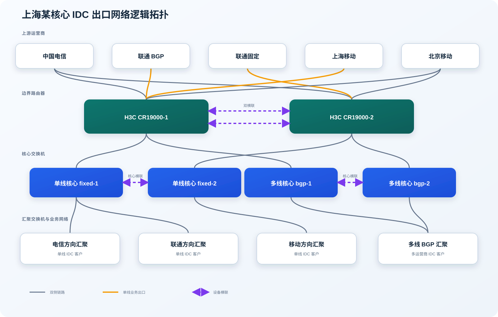
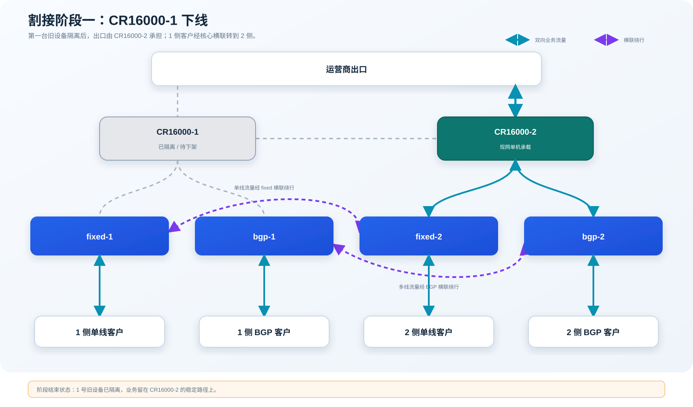
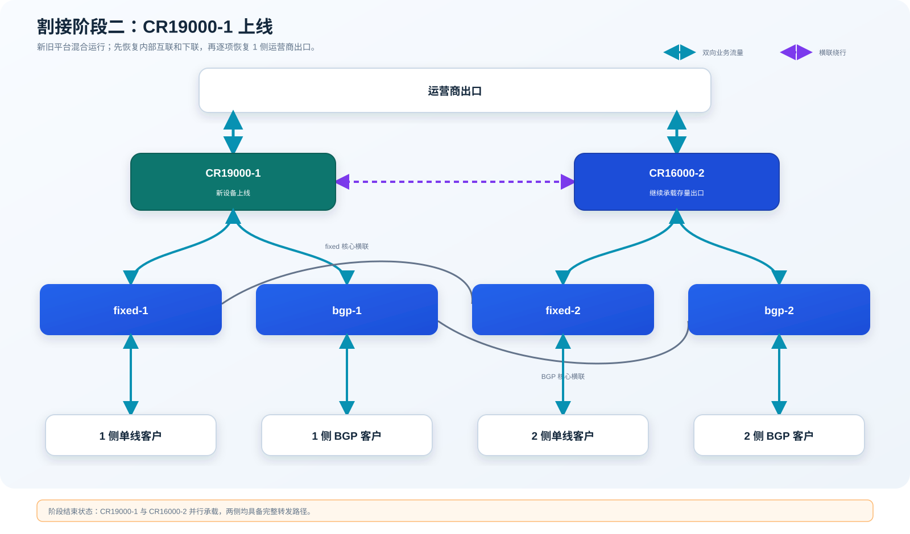
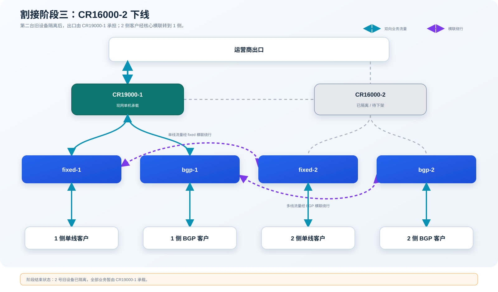
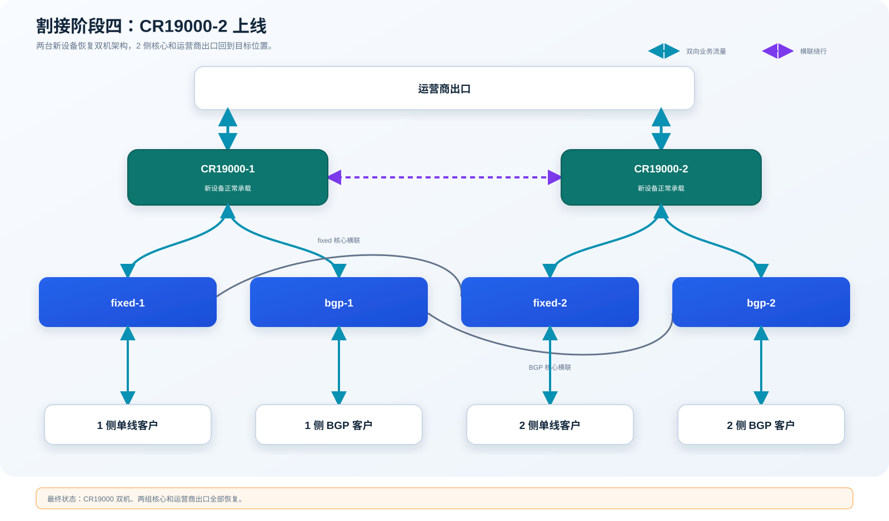

> [!NOTE]
> 为保护客户和生产环境安全，本文中的客户名称、机房名称、设备标识及拓扑细节均已脱敏，技术过程和项目结论保持不变。

## 项目背景

项目客户是一家二级运营商。它向中国电信、中国联通和中国移动购买公网 IP 与带宽，再把网络服务提供给自己的 IDC 客户。

上海某核心 IDC 原有两台 H3C CR16008，处在整张 IDC 网络的边界位置。向上，它们连接电信、联通、上海移动和北京移动四个需要分别协同、验证的出口方向；向下，它们连接单线核心、多线 BGP 核心以及大量 IDC 客户。旧设备诊断记录显示，整机运行时间已经超过 532 周。对这张网络来说，它们不是普通的两台路由器，而是整个 IDC 的总出口。

本次项目要用两台 H3C CR19000-8 替换这两台 CR16008。设备型号变了，板卡和端口变了，部分配置语法及默认行为也变了；但现网的路由关系、流量策略和客户访问习惯不能跟着变。

各出口的冗余条件并不相同。电信同时接入两台边界路由器；上海移动只有单线；联通 BGP 和联通固定是两套独立业务，分别接在 1 号和 2 号边界路由器上；北京移动还涉及异地协同。它们不能用同一种切换方法处理。

因此，这项工作不是“把旧设备搬走，再把新设备接上”。要迁移的是一整套已经运行多年的业务关系，其中既有看得见的端口和光纤，也有看不见的入向、出向选路和跨团队配合。

## 现网结构

两台边界路由器向下分别连接单线核心和多线 BGP 核心。`fixed-1` 与 `fixed-2`、`bgp-1` 与 `bgp-2` 之间各有横联。一侧边界路由器下线时，这些横联可以把该侧客户流量临时送到另一侧出口。

联通 BGP 与联通固定出口分别落在两台边界路由器上，并不互为同一业务的双机备份。因此，某一侧设备下线时，对应的联通出口仍要迁移到另一侧临时承载；新设备上线并完成验证后，再把线路迁回目标位置。

上海移动同样缺少等价备用出口，迁移时必须同时处理物理连接、本端配置和运营商对端状态。相比之下，电信可以利用双侧接入完成相对平滑的收敛。

## 我的职责

我负责的内容贯穿了方案讨论、配置治理、实验室验证和正式割接，并不只是在窗口期执行几段命令。

项目开始时，我先和客户网络团队、H3C 工程师、机房现场人员逐项推演割接顺序。讨论时最花时间的问题是：每断开一组链路后，入向和出向流量分别会走哪里；如果验证结果不符合预期，网络应该停在哪个仍然稳定的状态。随后再把端口、ODF 芯数、模块、跳线、供电、远程配合人和业务验证人落实到表格中。

这个准备过程形成了一份 30 项的细节确认记录。每个问题都要有结论和责任人，不能把“现场再看”留到正式窗口。旧设备一旦下电并搬出机柜，回退就要经历重新上架、重新布线和重新恢复配置，成本很高。因此，我们把主要的安全手段放在事前验证和阶段检查上。

## 第一阶段：配置清理

旧设备运行多年，配置里同时存在现网业务、历史遗留和临时调整。直接做一比一翻译，看似省事，实际上会把旧问题连同业务一起带到新平台，而且 CR16000 与 CR19000 在部分语法和默认行为上并不相同。

### 建立现网基线

我先保存两台旧路由器以及 `fixed-1`、`fixed-2`、`bgp-1`、`bgp-2` 的配置和诊断信息，再把上联、下联、横联、观察口和带外管理口整理成端口及布线矩阵。配置中的 ACL、静态路由、BGP、PBR、链路聚合、镜像、AAA、IPv4 和 IPv6 被分项对照。

整理时，我把配置分成四类：

1. 能和现网端口、邻居或业务对应上的有效配置；
2. 已经没有业务对象的历史配置；
3. 只在割接中间状态使用的临时配置；
4. 仅凭配置无法判断，需要客户或线路负责人确认的内容。

这种分类比“新旧配置做文本比较”多花时间，但它解决了一个很现实的问题：后来有人问某条策略为什么保留、为什么删除时，可以回到业务对象和确认记录，而不是依靠个人记忆解释。

### 关闭配置疑点

清理中发现的问题并不惊险，却很容易在割接时制造误判。例如，旧配置里有已经不用的联通备用接口、重复的 ACL 和无业务引用的地址族；PBR 应当配置在聚合接口，而不是重复下发到成员口；有些静态路由在新平台上需要关联出接口、BFD 或 Track，才能在线路中断后及时撤销；Router ID、路由策略调用方式、链路聚合模式以及 IPv6 联动也需要按新平台重新核对。

我没有对这些内容作经验性猜测，而是把它们放进确认清单：

- 这条接口是否还有业务，谁能确认；
- 这条路由在主链路和备链路之间如何切换；
- 这项配置是最终配置，还是只在某个割接阶段临时存在；
- 需要本端完成，还是必须等运营商对端同步操作；
- 修改后用什么现象判断结果正确。

最后交付的配置经过了业务核对、平台适配和客户确认，不是旧设备配置的机械翻译。与此同时，正式割接脚本也开始按阶段编排，每一步后面都跟着检查项，避免现场连续粘贴一大段命令后才发现前面已经偏离预期。

## 第二阶段：测试验证

正式割接前，我们搭建了接近现网关系的测试环境，包括两台 CR19000、两组单线和多线核心、模拟 ISP 设备以及测试服务器。除了检查设备能否正常启动，更主要的是观察新旧平台差异会怎样影响实际流量。

### 硬件检查

两台新设备分别做了硬件检查。测试范围包括版本和板卡识别、温度、CPU、内存、光模块、风扇、电源冗余、主控倒换、板卡热插拔、ECC 和交换网板等。两份测试记录的结果均为正常。

核心出口设备如果带着硬件隐患上线，后面的协议和业务验证做得再完整也没有意义。测试完成后，设备版本、板卡位置、模块类型和供电方式都被冻结，现场按同一基线交付。

### 业务与流量验证

软件侧覆盖了 OSPF、BGP、PBR、VRF、IPv4/IPv6、SFlow、端口镜像、AAA 和负载相关功能。验证不只看端口是否 Up、邻居是否 Established，还要从客户侧发起流量，分别检查：

- 单线客户通过指定运营商出口访问外网；
- 多线 BGP 客户的入向和出向路径是否符合策略；
- 一侧边界路由器断开后，流量是否能经过核心横联转到另一侧；
- 多条并发流的负载分担是否和旧平台一致；
- 正向和反向流量是否都能返回，IPv4 与 IPv6 是否都成立。

最初的单流测试不足以反映负载分担效果，因此后续改为多流并发，并增加反向打流。这个调整也被写进正式窗口的验证方法，避免只凭一次 Ping 或一个 TCP 会话判断整条路径正常。

### 测试结论回写

测试过程中暴露了几项不能留到现场处理的差异：

- 部分静态路由如果只指向下一跳，接口 Down 后仍可能继续迭代到 `Null0`。最终配置增加了出接口或相应联动，确保故障时路由按预期消失。
- 两台 CR19000 之间的链路曾因模块兼容问题不能正常恢复，随后明确使用 H3C 原厂模块，并为跨模块链路准备备件和备用跳线。
- 新旧平台的默认负载分担方式不同，相关全局配置需要提前对齐。
- Route Policy 调用 Prefix List 的写法、PBR 的部署位置以及部分 IPv6、BFD、Track 配置需要按新平台调整。
- 北京移动涉及远端操作，不能只检查本端接口；对端动作、协议收敛和业务验证被放到同一时间点执行。

每发现一项问题，我都同步修改最终配置、割接步骤和检查表。这样做的好处是，现场人员看到的是同一个版本，不会出现“测试报告里已经改过，割接脚本里还是旧写法”的情况。

实验室还完整走了一遍设备上下电、链路迁移和业务验证。跳线长度、ODF 芯数、模块位置、供电路由和备件都在这次演练后确认。到了正式窗口，现场不用再争论一根线该插哪里，也能更快判断异常来自线路还是配置，这比节省几分钟命令输入更有用。

## 第三阶段：正式割接

正式方案把整场割接拆成四个可以独立验证的网络状态。每完成一段，先停下来检查路由、流量和业务；只有当前状态达到预期，才进入下一段。这样即使某个环节需要延长处理，网络也能停留在一台设备稳定承载或新旧设备混合承载的状态，而不会卡在一半链路已经断开、另一半还没恢复的位置。

### 割接准备

现场工作被分成配置、布线、设备上架、厂商支持和业务验证几类角色。所有跳线按设备、端口、ODF 芯数和对端做双向标签；不同方向使用约定颜色；电源 A/B 路提前确认；原厂模块、跨模块备线和管理线放在可直接取用的位置。北京移动等需要远端协同的线路，也提前确认了联系人和操作时点。

配置人员每执行完一组动作，会报出设备、端口和预期状态；布线人员复述标签后再拔插；验证人员根据清单检查路由和业务。端口亮灯只能说明物理层建立，不能作为进入下一步的依据。

### 阶段一：CR16000-1 下线

第一步先隔离 1 号旧设备，但不会直接下电。我们按运营商出口、单线下联、多线下联、横联的顺序逐组处理，让每一次变化都能观察。

电信在两台边界路由器上都有接入，可以先关闭 CR16000-1 一侧，让流量收敛到 CR16000-2。联通 BGP 和上海移动位于 1 号设备一侧，两者都没有可直接接管的同业务备用链路，因此需要把物理连接和临时配置迁到 CR16000-2。运营商方向恢复并通过验证后，再继续处理下游。北京移动则按约定关闭 1 号侧链路，并同步核查对端状态。

上游处理完成后，再断开 CR16000-1 与 `fixed-1`、`bgp-1` 的下联。此时 1 侧客户仍然接在自己的核心上，但出口流量分别通过 `fixed-1 ↔ fixed-2` 和 `bgp-1 ↔ bgp-2` 横联转到 2 侧，再由 CR16000-2 出网。确认横联上出现预期流量后，才断开两台旧路由器之间的横联、观察口和管理相关连接。

这个阶段的检查包括：CR16000-1 相关邻居和路由按计划撤销，CR16000-2 的运营商邻居及路由正常，单线和多线客户的入向、出向都能走通，横联流量与预期一致。检查通过后，CR16000-1 才正式下电、拆线并搬出机柜。

### 阶段二：CR19000-1 上线

CR19000-1 上架、接电并接入带外管理后，先检查主控、板卡、风扇、电源、温度和模块状态。设备本身正常，才开始恢复业务链路。

连接顺序从内部到外部。先建立 CR19000-1 与 CR16000-2 之间的双横联，为新旧设备混合运行准备内部通道；随后接入 `bgp-1` 和 `fixed-1`，检查聚合接口、VLAN、内部路由以及核心横联上的转发。到这里，新设备已经能接收下游流量，但还没有接入全部运营商线路。

内部路径验证完成后，才依次恢复 CR19000-1 一侧的电信、联通 BGP、上海移动和北京移动出口。每恢复一个方向，都要分别看物理状态、协议状态、路由变化和实际业务。上海移动与联通 BGP 尤其需要确认临时迁到 CR16000-2 的连接和配置已经按步骤撤回，不能让同一业务同时残留在新旧两个位置。

这个状态是整场割接的第一个关键检查点。它既验证了 CR19000 能否接入现网，也保留了 CR16000-2 继续承载业务的能力。只有当 1 侧单线客户、多线 BGP 客户以及各运营商入向、出向都达到预期后，才开始处理第二台旧设备。

### 阶段三：CR16000-2 下线

处理 CR16000-2 时，方法与第一台相似，但业务关系并不完全对称，不能照抄前一段脚本。

先关闭 CR16000-2 一侧的电信出口。联通固定出口原本在 2 号设备上，需要临时迁到 CR19000-1，并核对静态路由、BFD/Track 以及回程路径；北京移动按既定时点配合关闭 2 侧连接。上游业务确认转到 CR19000-1 后，再依次断开 `fixed-2` 和 `bgp-2` 下联。

此时 2 侧客户分别经过 `fixed-2 ↔ fixed-1`、`bgp-2 ↔ bgp-1` 横联，将流量送到 CR19000-1。我们会同时观察 CR19000-1 的端口、CPU、路由表和接口流量，确认单机承载下没有异常，再断开 CR16000-2 与 CR19000-1 的横联、观察口和管理连接。

这是整场割接风险最高的一段。此时第一台旧设备已经搬离，第二台也即将下架，网络短时间内只剩 CR19000-1 承载。验证人员会按运营商方向逐一发起正向和反向测试，并覆盖单线、BGP、IPv4 和 IPv6；配置人员同步检查邻居、路由数量、下一跳、BFD/Track 和接口错误计数。任何一个关键方向不符合预期，都先在当前状态排查，不带着问题去上第二台新设备。

确认 CR19000-1 稳定承载后，CR16000-2 才下电搬出，随后完成 CR19000-2 的上架、供电、带外接入和硬件检查。

### 阶段四：CR19000-2 上线

CR19000-2 的恢复顺序同样是先内部、后外部。先建立与 CR19000-1 的双横联，再接入 `bgp-2`、`fixed-2`，确认 2 侧客户不再依赖核心横联绕行。然后恢复电信 2 侧出口，把临时放在 CR19000-1 上的联通固定出口迁回 CR19000-2，再恢复北京移动、观察口和管理链路。

链路全部恢复后，还要删除 CR19000-1 上为联通固定出口增加的临时配置，补齐 CR19000-2 的备用路由，检查两台设备的最终配置差异，并做一次完整验证：

- 两台设备的板卡、电源、风扇、温度、CPU、内存和光模块无异常；
- 上联、下联、横联、镜像和管理接口状态及光功率正常；
- BGP、静态路由、BFD、Track、IPv4 和 IPv6 状态符合设计；
- 电信、联通、上海移动、北京移动四个方向的入向和出向均经过预期设备；
- 单线客户和多线 BGP 客户分别完成正向、反向及多流测试；
- 临时配置已清理，设备配置已保存，并留存最终快照用于次日复核。

这套验证不是由一个人报“都通了”就结束。配置、现场和业务验证人员分别确认自己的结果，出现不一致时回到具体线路和流量方向定位。正式割接脚本中的最后几项，专门留给配置保存、差异复核和遗留事项登记，避免窗口临近结束时匆忙收场。

## 项目复盘

项目完成了两台 CR16008 向两台 CR19000-8 的替换，恢复了运营商出口、单线核心、多线 BGP 核心、双机横联、镜像和管理连接。割接后的配置快照和保存记录被继续留存，用于后续验收和问题追溯。

回头看，项目里最费精力的是下面几件事：

- **把业务关系查清楚。** 同样标为“运营商上联”，双线电信、单线上海移动、联通 BGP 和联通固定出口的处理方法完全不同，必须落实到具体流量路径。
- **把不确定项在窗口前关掉。** 配置疑点、模块兼容、ODF 芯数、远端配合和验证人都提前得到结论，现场才有可能按节奏推进。
- **让测试结果进入生产方案。** 实验室发现的问题最终都回写到配置、脚本和检查表，而不是只留在测试报告里。
- **把复杂割接拆成可检查的状态。** 四个状态各有明确的流量路径和完成条件，团队知道什么时候可以继续、什么时候必须停下来。
- **让多人协作有同一份依据。** 配置人员、现场布线、厂商和业务验证人员使用同一套端口表、步骤表和检查项，减少口头传递造成的偏差。

这次项目留下的不只是两台上线的新设备，还包括现网基线、逻辑拓扑、布线表、配置差异、问题清单、硬件与软件测试记录、割接脚本以及多阶段配置快照。以后再处理同类核心设备替换，不需要从个人记忆重新开始。
